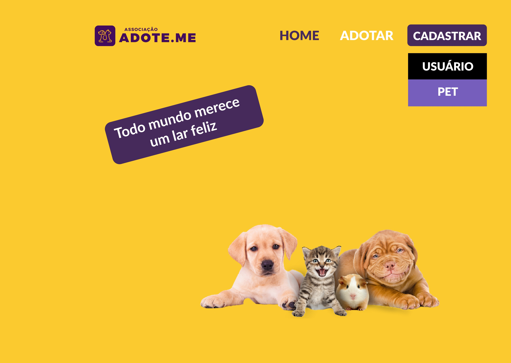
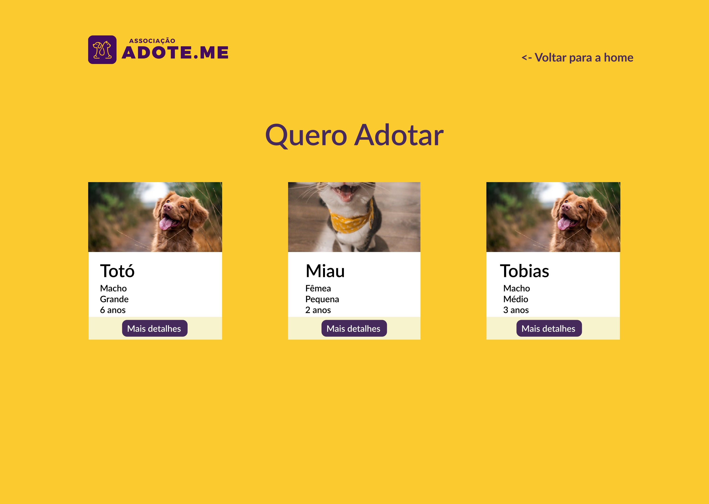
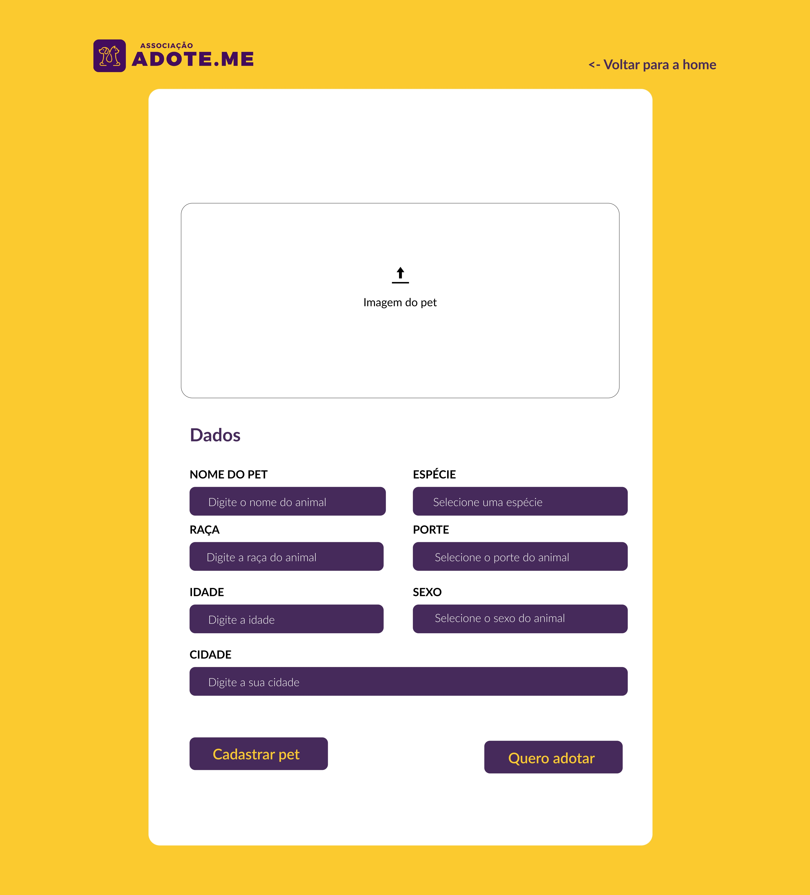

<h1> Asssociação adote-me </h1>

 Software implementado para o trabalho prático da disciplina de Engenharia de Software II 
 

 
  
  
  
  

 
 
<h2>Índice</h2>

- [Projeto](#o-projeto)
- [Layout](#-layout)
- [Tecnologias utilizadas](#-tecnologias-utilizadas)
- [Organização das pastas](#-organizacao-das-pastas)
- [Testes](#-testes)
- [Como fazer download dos projetos](#como-fazer-download-dos-projetos)
- [Autores](#-autores)
- [Licença](#-licença)

<h2> O Projeto </h2>

 A aplicação Adote-me tem como objetivo divulgar pets para adoção, o usuário poderá ver os pets que estão cadastrados e entrar em contato com quem está anunciando.
Também é possível anunciar pets pela plataforma, mas antes o usuário deverá cadastrar suas informações.

<h2> Layout </h2>

Para ter acesso a este layout, você pode entrar por este link do  [Figma](https://www.figma.com/file/IGV0ptubUS3gEOW1FrsfwQ/Associa%C3%A7%C3%A3o-adote-me?node-id=0%3A1).

<h2> Tecnologias utilizadas</h2>
As tecnologias que utilizamos para a implementação do sistema foram:

- JavaScript
- TypeScript
- NodeJS
- ReactJS

<h2> Organização das pastas </h2>
<h3> Backend </h3>
As pastas do backend foram organizadas da seguinte maneira:

- __src__: Ficam todos os arquivos com as funcionalidades do backend da aplicação.
  - __tests__: Ficam os testes do backend.
  - __config__: Arquivos de configurações.
  - __models__: Arquivos responsáveis por conexões com o banco de dados
  - __modules__: Ficam os módulos da aplicação. Dentro dos módulos da aplicação ficam cada controlador com uma funcionalidade específica.
  - __Shared__: Nesta pasta ficam arquivos de são compartilhadas em todos os módulos, que são:

    - __migrations__: Responsáveis pela criação de tabelas dentro do banco.
    - __Routes__: Responsável por acesso as rotas da aplicação.
    - __Server__: Responsável por conectar a API ao servidor.

  Fora da pasta src tem a pasta tmp, que armazenam os arquivos de upload, que são temporários.

  <h3>Frontend</h3>
  As pastas do frontend foram organizadas da seguinte maneira:

  - __public__: Se referem a todos arquivos públicos de uso geral.
  - __src__: Ficam todos os arquivos com as funcionalidades do frontend da aplicação.
    - __tests__: Ficam os testes do frontend.
    - __assets__: Ficam os arquivos de imagens que foram usados no projeto.
    - __components__: Ficam os componentes que foram usados nas páginas.
    - __pages__: Ficam os arquivos em react das páginas e também suas estilizações em CSS.
    - __services__: Fica o arquivo responsável em fazer a conexão do frontend com o backend.
    
    Fora destas pastas possuem alguns arquivos globais e outros de configuração.

    <h2>Testes</h2>

    <h3>Backend</h3>

    *Visualizar os pets cadastrados*
  
    Testa se consegue visualizar os pets cadastrados no banco de dados.

    *Criar usuários*

    Testa se consegue cadastrar novos usuários no banco de dados.

    *Visualizar usuários*

    Testa se consegue visualizar os usuários cadastrados no banco de dados.

    <h3> Frontend </h3>

    *Teste para saber se a página dashboard está renderizando*

    Testa se todos os elementos da página dashboard foram carregados e estão sendo exibidos na tela.

    *Teste para saber se a página Cadastrar Usuário está renderizando*

    Testa se todos os elementos da página cadastrar usuário foram carregados e estão sendo exibidos na tela.

    *Teste para saber se a página Cadastrar Pet está renderizando*

    Testa se todos os elementos da página cadastrar pet foram carregados e estão sendo exibidos na tela.

    <h2> Como fazer download do projeto </h2>

    - Faça um clone do projeto.
    - Para ver o projeto funcionando tenha o node, npm e yarn instalados em sua máquina.
    - Acesse a pasta server e instale as dependências rodando um: `yarn` ou `npm install`.
    - Repita o mesmo processo na pasta web.
    - Agora para executar o programa primeiro você deve deixar o servidor rodando, então na pasta do servidor, execute o comando `yarn start` ou `npm start`.
    - Assim que o servidor estiver rodando rode na pasta web o comando `yarn start` ou `npm start`.

    <h2> Autores </h2>
    Este projeto foi realizado pelos seguintes autores:

    - Anderson Fernandes
    - Juliana Lemos
    - Rosabel Braga

    <h2> Licença </h2>
    Este projeto está sobre a licença de 

